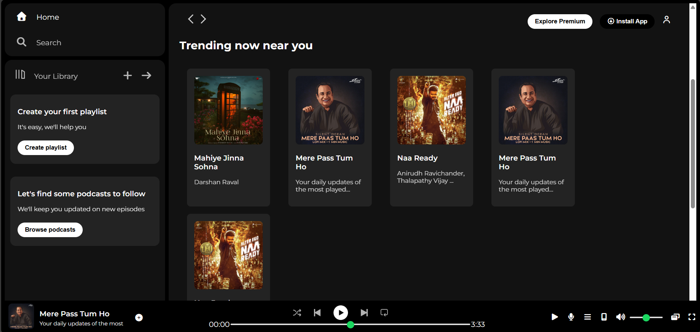

# Spotify Clone 🎧

This is a Spotify Clone web project created using HTML, CSS, and Bootstrap.
The project focuses on replicating the user interface of the Spotify web player
with a clean layout and responsive design.

## 📌 Project Description
The Spotify Clone is a front-end application that mimics the appearance and
layout of Spotify. It includes a sidebar, navigation menu, recently played
section, and a music player UI. This project is built only for learning and
practice purposes.

## 🛠️ Technologies Used
- HTML
- CSS
- Bootstrap
- VS Code

## ✨ Features
- Spotify-inspired dark theme UI
- Sidebar navigation (Home, Search, Library)
- Recently Played section
- Trending songs/playlists section
- Music player layout
- Responsive design using Bootstrap
- Clean and modern UI

## 📂 Project Structure
```text
Spotify-Clone/
├── project.html
├── style.css
├── assets/
│   ├── images/
│   └── icons/
└── README.md
```
## ▶️ How to Run
1. Download or clone the repository
2. Open `project.html` in any web browser
3. Enjoy the Spotify-like interface

## 🎯 Learning Outcomes
- Using Bootstrap grid system
- Building responsive layouts
- UI cloning with HTML and CSS
- Understanding component-based design

## 👨‍💻 Author
Omkar Jadhav  
Web Development Project

## 📸 Project Screenshot

